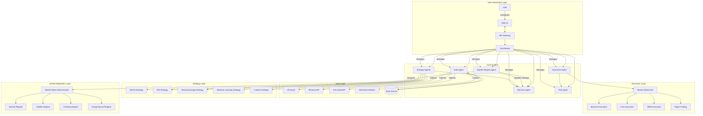

```mermaid
graph TB
    subgraph "User Interaction Layer"
        User[User]
        WebUI[Web UI]
        APIGateway[API Gateway]
        User -->|Configures| WebUI
        WebUI <--> APIGateway
        APIGateway --> Coordinator
    end

    subgraph "Core System"
        Coordinator[Coordinator]
        DataAgent[Data Agent]
        StrategyAgents[Strategy Agents]
        DecisionAgent[Decision Agent]
        ExecutionAgent[Execution Agent]
        RiskAgent[Risk Agent]
        MarketRegimeAgent[Market Regime Agent]
        Coordinator -->|Manages| DataAgent
        Coordinator -->|Manages| StrategyAgents
        Coordinator -->|Manages| DecisionAgent
        Coordinator -->|Manages| ExecutionAgent
        Coordinator -->|Manages| RiskAgent
        Coordinator -->|Manages| MarketRegimeAgent
    end

    subgraph "Data Layer"
        YFinance[YFinance]
        Binance[Binance API]
        Futu[Futu OpenAPI]
        IBKR[Interactive Brokers]
        DataSource[(Data Source)]
        DataAgent -->|Collects| YFinance
        DataAgent -->|Collects| Binance
        DataAgent -->|Collects| Futu
        DataAgent -->|Collects| IBKR
        DataAgent <--> DataSource
        DataAgent --> DataSource
    end

    subgraph "Strategy Layer"
        MACD[MACD Strategy]
        RSI[RSI Strategy]
        MovingAvg[Moving Average Strategy]
        ML[Machine Learning Strategy]
        Custom[Custom Strategy]
        StrategyAgents --> MACD
        StrategyAgents --> RSI
        StrategyAgents --> MovingAvg
        StrategyAgents --> ML
        StrategyAgents --> Custom
        StrategyAgents --> DecisionAgent
    end

    subgraph "Execution Layer"
        BrokerAbstraction[Broker Abstraction]
        BinanceExec[Binance Execution]
        FutuExec[Futu Execution]
        IBKRExec[IBKR Execution]
        PaperTrading[Paper Trading]
        ExecutionAgent --> BrokerAbstraction
        BrokerAbstraction --> BinanceExec
        BrokerAbstraction --> FutuExec
        BrokerAbstraction --> IBKRExec
        BrokerAbstraction --> PaperTrading
        ExecutionAgent --> RiskAgent
    end

    subgraph "Market Adaptation Layer"
        MarketState[Market State Determination]
        NormalRegime[Normal Regime]
        VolatileRegime[Volatile Regime]
        TrendingRegime[Trending Regime]
        RangeBoundRegime[Range-Bound Regime]
        MarketRegimeAgent -->|Analyzes| MarketState
        MarketRegimeAgent -->|Updates Settings| DecisionAgent
        MarketState --> NormalRegime
        MarketState --> VolatileRegime
        MarketState --> TrendingRegime
        MarketState --> RangeBoundRegime
        MarketRegimeAgent --> DecisionAgent
    end

    Coordinator --> DataAgent
    Coordinator --> StrategyAgents
    Coordinator --> DecisionAgent
    Coordinator --> ExecutionAgent
    Coordinator --> RiskAgent
    Coordinator --> MarketRegimeAgent
```
