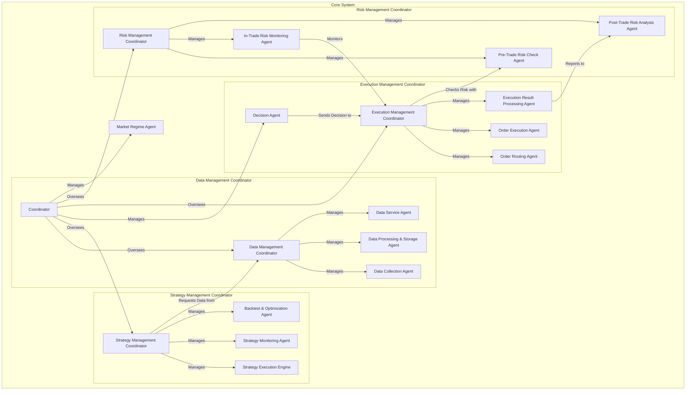

```mermaid
graph TB
    subgraph "Core System"
        Coordinator[Coordinator]

        subgraph "Data Management Coordinator"
            DataCoordinator[Data Management Coordinator]
            DataCollectionAgent[Data Collection Agent]
            DataProcessingAgent[Data Processing & Storage Agent]
            DataServiceAgent[Data Service Agent]
            DataCoordinator -->|Manages| DataCollectionAgent
            DataCoordinator -->|Manages| DataProcessingAgent
            DataCoordinator -->|Manages| DataServiceAgent
            Coordinator -->|Oversees| DataCoordinator
        end

        subgraph "Strategy Management Coordinator"
            StrategyCoordinator[Strategy Management Coordinator]
            StrategyExecutionEngine[Strategy Execution Engine]
            StrategyMonitoringAgent[Strategy Monitoring Agent]
            BacktestOptimizationAgent[Backtest & Optimization Agent]
            StrategyCoordinator -->|Manages| StrategyExecutionEngine
            StrategyCoordinator -->|Manages| StrategyMonitoringAgent
            StrategyCoordinator -->|Manages| BacktestOptimizationAgent
            StrategyCoordinator -->|Requests Data from| DataCoordinator
            Coordinator -->|Oversees| StrategyCoordinator
        end

        DecisionAgent[Decision Agent]
        Coordinator -->|Manages| DecisionAgent

        subgraph "Execution Management Coordinator"
            ExecutionCoordinator[Execution Management Coordinator]
            OrderRoutingAgent[Order Routing Agent]
            OrderExecutionAgent[Order Execution Agent]
            ExecutionResultAgent[Execution Result Processing Agent]
            DecisionAgent -->|Sends Decision to| ExecutionCoordinator
            ExecutionCoordinator -->|Manages| OrderRoutingAgent
            ExecutionCoordinator -->|Manages| OrderExecutionAgent
            ExecutionCoordinator -->|Manages| ExecutionResultAgent
            Coordinator -->|Oversees| ExecutionCoordinator
        end

        subgraph "Risk Management Coordinator"
            RiskCoordinator[Risk Management Coordinator]
            PreTradeRiskAgent[Pre-Trade Risk Check Agent]
            InTradeRiskAgent[In-Trade Risk Monitoring Agent]
            PostTradeRiskAgent[Post-Trade Risk Analysis Agent]
            ExecutionCoordinator -->|Checks Risk with| PreTradeRiskAgent
            RiskCoordinator -->|Manages| PreTradeRiskAgent
            RiskCoordinator -->|Manages| InTradeRiskAgent
            RiskCoordinator -->|Manages| PostTradeRiskAgent
            InTradeRiskAgent -->|Monitors| ExecutionCoordinator
            ExecutionResultAgent -->|Reports to| PostTradeRiskAgent
            Coordinator -->|Oversees| RiskCoordinator
        end

        MarketRegimeAgent[Market Regime Agent]
        Coordinator -->|Manages| MarketRegimeAgent
    end
```
